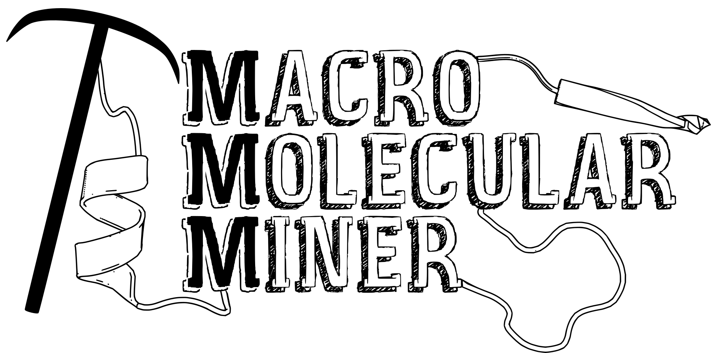

# mmm
The **M**acro**m**olecular **M**iner framework for the template-free and unsupervised detection of substructure similarity in biological structure data.

 

## Background
The biological function of proteins and nucleic acids, such as riboswitches or ribozymes, relies on the correct arrangement of small substructural units to catalyze substrates, bind ligands, or to preserve an ordered state. These molecular building blocks have evolved to retain similar interaction patterns and geometrical features to ensure functionality. While some of these patterns are reflected in recurring sequence motifs, evolutionarily remote proteins may only share a small set of similar structural motifs, which are not obvious on sequence level. The mmm software uses methods originated from data mining to identify structurally conserved, and sequence separated building blocks in macromolecular structure data.

## Use Cases
- identify functionally relevant regions in datasets of macromolecular structures (proteins/nucleic acids)
- characterize ligand binding environments by including ligands
- analyze trajectories to uncover the structurally most stable regions

### Dependencies
The mmm software depends on the fabulous [SiNGA](https://github.com/cleberecht/singa) framework, available on [Maven Central](https://mvnrepository.com/artifact/de.bioforscher.singa).

### Usage
For detailed instructions on how to use mmm please refer to the [wiki pages](https://github.com/enauz/mmm/wiki).

---

### Citation

If you use this software in your project, please cite:

>Kaiser, F. & Labudde, D. (2017)
>
>Unsupervised Discovery of Geometrically Common Structural Motifs and Long-Range Contacts in Protein 3D Structures
>
>_IEEE/ACM Trans Comput Biol Bioinform_, doi:10.1109/TCBB.2017.2786250